# React Native Textinput Effects

I've come across with [those beautiful](http://tympanus.net/Development/TextInputEffects) text inputs created and [blogged](http://tympanus.net/codrops/2015/01/08/inspiration-text-input-effects) by **Codrops** and wanted to port them to react-native. Some of those text fields are now ready to use in iOS and android thanks to react-native.

There is also a native iOS library called [TextFieldEffects](https://github.com/raulriera/TextFieldEffects) which has built some of them in Swift.

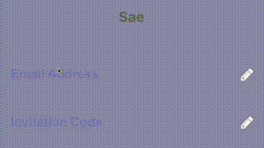

## Blog Post

I've recently written a blog post about [Creating an Animated TextField with React Native](https://bilir.me/blog/creating-an-animated-textfield-with-react-native). While it isn't directly related to this library, I think you might still find it useful to understand the basics of creating an animated text input with `React Native Animated` library.

## Installation

The latest version of this project needs **react-native >= 0.55(March 2018 release)** due to **createRef** usage. Go with the latest version:

`$ npm install react-native-textinput-effects --save`

You can stick with version 0.4 if you have an older react-native version:

`$ npm install react-native-textinput-effects@0.4.2 --save`

You also need to install [react-native-vector-icons](https://github.com/oblador/react-native-vector-icons) if you'd like to use a TextInputEffect component with an icon. Please check out [Installation section](https://github.com/oblador/react-native-vector-icons#installation) on that project.

## How to use

### Common Props

| Prop | Type | Description |
|---|---|---|
|**`label`**|String|Displayed as placeholder string of the input.|
|**`style`**|View Style Object|Applied to the root container of the input.|
|**`labelStyle`**|View Style Object|Applied to the container of the label view.|
|**`inputStyle`**|Text Style Object|Applied to the TextInput component.|
|**`value`**|String|This value will be applied to the TextInput and change it's state on every render. Use this prop if you want a [Controlled Component](https://facebook.github.io/react/docs/forms.html#controlled-components).|
|**`defaultValue`**|String|If you want to initialize the component with a non-empty value, you can supply a defaultValue prop. This prop creates an [Uncontrolled Component](https://facebook.github.io/react/docs/forms.html#uncontrolled-components) and is only used during initial render.|

You can also use default [TextInput Props](https://facebook.github.io/react-native/docs/textinput.html#props). They'll be passed into TextInput component. E.g., use `TextInput`'s `onChange` prop to be notified on text changes.
```js
<Sae
  onChangeText={(text) => { this.setState({textValue: text}) }
/>
```

### Props for TextInputEffects with an Icon

This component needs `Icon` component from `react-native-vector-icons` to operate with icons. You should import it before creating a TextInputEffects component.

`import Icon from 'react-native-vector-icons/FontAwesome';`

| Prop | Type | Description |
|---|---|---|
|**`iconClass`**|Object|The Icon component class you've imported from react-native-vector-icons.|
|**`iconName`**|String|Name of the icon that is passed to Icon component.|
|**`iconColor`**|String|Applied to the Icon component.|
|**`iconSize`**|Number|Applied to the Icon component.|


## Example

See [TextInputEffectsExample.js](Example/TextInputEffectsExample.js) file.

Follow those steps to run the example:

1. Clone the repo `git clone https://github.com/halilb/react-native-textinput-effects && cd react-native-textinput-effects/Example`
2. Install dependencies `npm install``
3. Follow [official instructions](https://facebook.github.io/react-native/docs/getting-started.html) to run the example project in a simulator or device.

You can also check out the example library without any installation on [Appetize.io](https://appetize.io/app/uhgu1wc1htqfcf7bp812gevr2r?device=iphone6s&scale=75&orientation=portrait&osVersion=9.3)!

## Input Types

### Sae

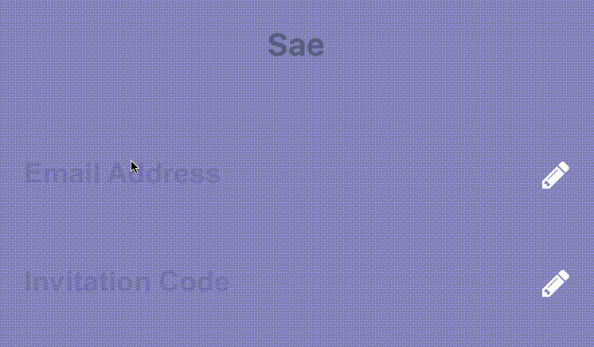


```js
import FontAwesomeIcon from 'react-native-vector-icons/FontAwesome';
import { Sae } from 'react-native-textinput-effects';

const saeInput = (
  <Sae
    label={'Email Address'}
    iconClass={FontAwesomeIcon}
    iconName={'pencil'}
    iconColor={'white'}
    inputPadding={16}
    labelHeight={24}
    // active border height
    borderHeight={2}
    // TextInput props
    autoCapitalize={'none'}
    autoCorrect={false}
  />
);
```

### Fumi

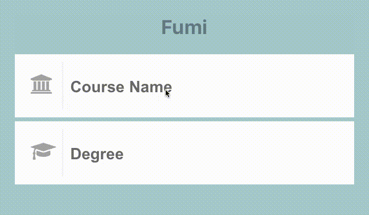


```js
import FontAwesomeIcon from 'react-native-vector-icons/FontAwesome';
import { Fumi } from 'react-native-textinput-effects';

const fumiInput = (
  <Fumi
    label={'Course Name'}
    iconClass={FontAwesomeIcon}
    iconName={'university'}
    iconColor={'#f95a25'}
    iconSize={20}
    iconWidth={40}
    inputPadding={16}
  />
);
```
### Kohana


Kohana supports [Animated Native Driver](https://facebook.github.io/react-native/docs/animations.html#using-the-native-driver). You can use native driver by passing `useNativeDriver`.

```js
import MaterialsIcon from 'react-native-vector-icons/MaterialIcons';
import { Kohana } from 'react-native-textinput-effects';

const kohanaInput = (
  <Kohana
    style={{ backgroundColor: '#f9f5ed' }}
    label={'Line'}
    iconClass={MaterialsIcon}
    iconName={'directions-bus'}
    iconColor={'#f4d29a'}
    inputPadding={16}
    labelStyle={{ color: '#91627b' }}
    inputStyle={{ color: '#91627b' }}
    labelContainerStyle={{ padding: 20 }}
    iconContainerStyle={{ padding: 20 }}
    useNativeDriver
  />
);
```

### Makiko

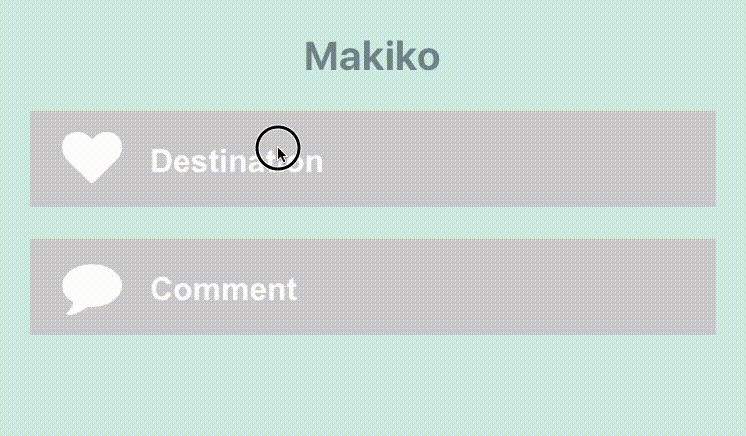


```js
import FontAwesomeIcon from 'react-native-vector-icons/FontAwesome';
import { Makiko } from 'react-native-textinput-effects';

const makikoInput = (
  <Makiko
    label={'Comment'}
    iconClass={FontAwesomeIcon}
    iconName={'comment'}
    iconColor={'white'}
    inputPadding={16}
    inputStyle={{ color: '#db786d' }}
  />
);
```
Note: Icon component expands and covers the input. So, the icon should not have any blank spaces for the animation experience. This is the limitation for Makiko.

### Isao

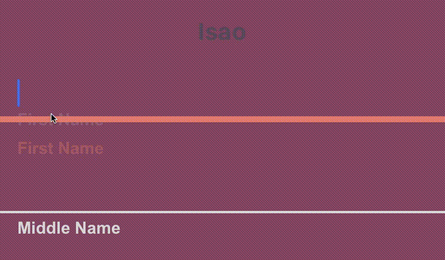


```js
import { Isao } from 'react-native-textinput-effects';

const isaoInput = (
  <Isao
    label={'First Name'}
    // this is applied as active border and label color
    activeColor={'#da7071'}
    // active border height
    borderHeight={8}
    inputPadding={16}
    labelHeight={24}
    // this is applied as passive border and label color
    passiveColor={'#dadada'}
  />
);
```

### Hoshi

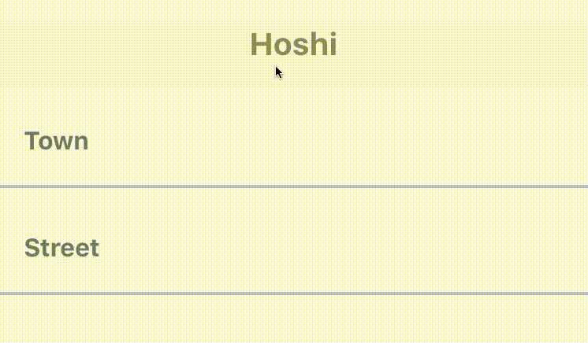


```js
import { Hoshi } from 'react-native-textinput-effects';

const hoshiInput = (
  <Hoshi
    label={'Town'}
    // this is used as active border color
    borderColor={'#b76c94'}
    // active border height
    borderHeight={3}
    inputPadding={16}
    // this is used to set backgroundColor of label mask.
    // please pass the backgroundColor of your TextInput container.
    backgroundColor={'#F9F7F6'}
  />
);
```

### Jiro

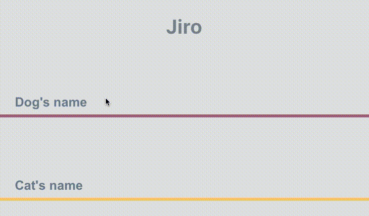


```js
import { Jiro } from 'react-native-textinput-effects';

const jiroInput = (
  <Jiro
    label={'Dog\'s name'}
    // this is used as active and passive border color
    borderColor={'#9b537a'}
    inputPadding={16}
    inputStyle={{ color: 'white' }}
  />
);
```

### Kaede

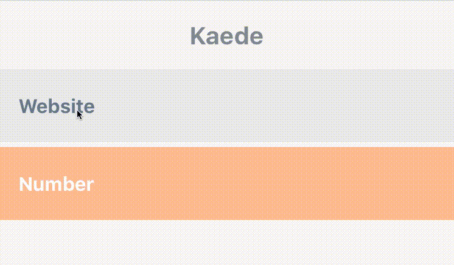


```js
import { Kaede } from 'react-native-textinput-effects';

const kaedeInput = (
  <Kaede
    label={'Website'}
    inputPadding={16}
  />
);
```

### Akira

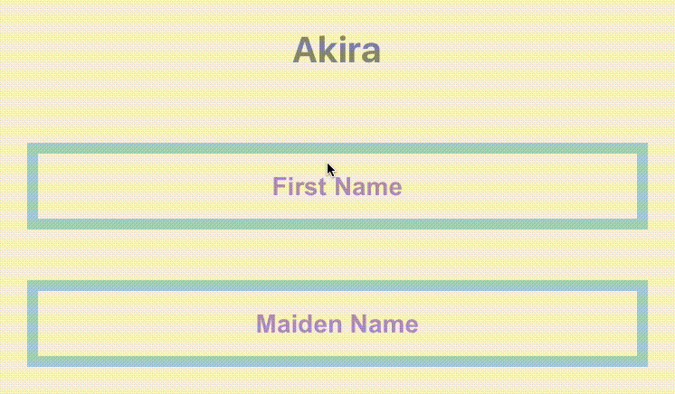


```js
import { Akira } from 'react-native-textinput-effects';

const akiraInput = (
  <Akira
    label={'First Name'}
    // this is used as active and passive border color
    borderColor={'#a5d1cc'}
    inputPadding={16}
    labelHeight={24}
    labelStyle={{ color: '#ac83c4' }}
  />
);
```

### Madoka

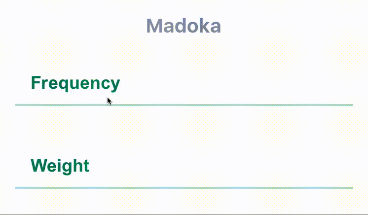


```js
import { Madoka } from 'react-native-textinput-effects';

const madokaInput = (
  <Madoka
    label={'Frequency'}
    // this is used as active and passive border color
    borderColor={'#aee2c9'}
    inputPadding={16}
    labelHeight={24}
    labelStyle={{ color: '#008445' }}
    inputStyle={{ color: '#f4a197' }}
  />
);
```

### Hideo

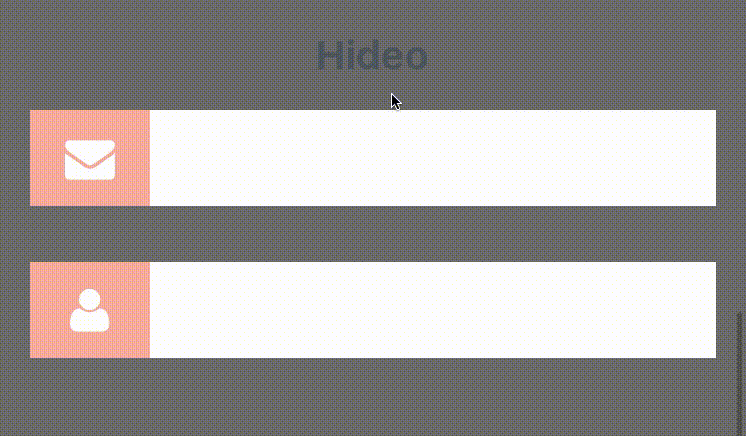


```js
import FontAwesomeIcon from 'react-native-vector-icons/FontAwesome';
import { Hideo } from 'react-native-textinput-effects';

const hideoInput = (
  <Hideo
    iconClass={FontAwesomeIcon}
    iconName={'envelope'}
    iconColor={'white'}
    // this is used as backgroundColor of icon container view.
    iconBackgroundColor={'#f2a59d'}
    inputStyle={{ color: '#464949' }}
  />
);
```

## Licence
[MIT](http://opensource.org/licenses/mit-license.html)
